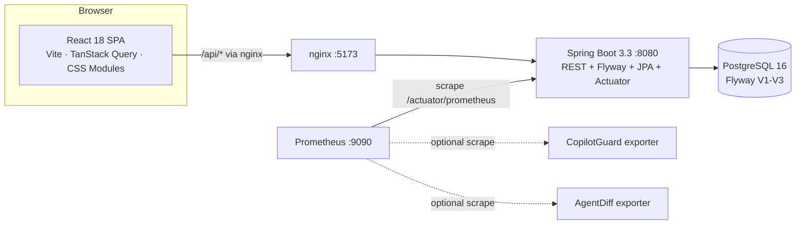
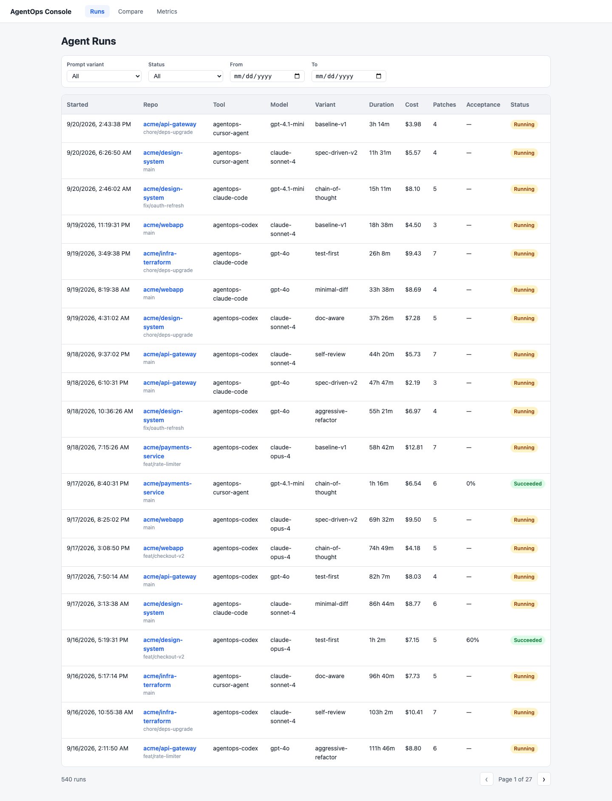
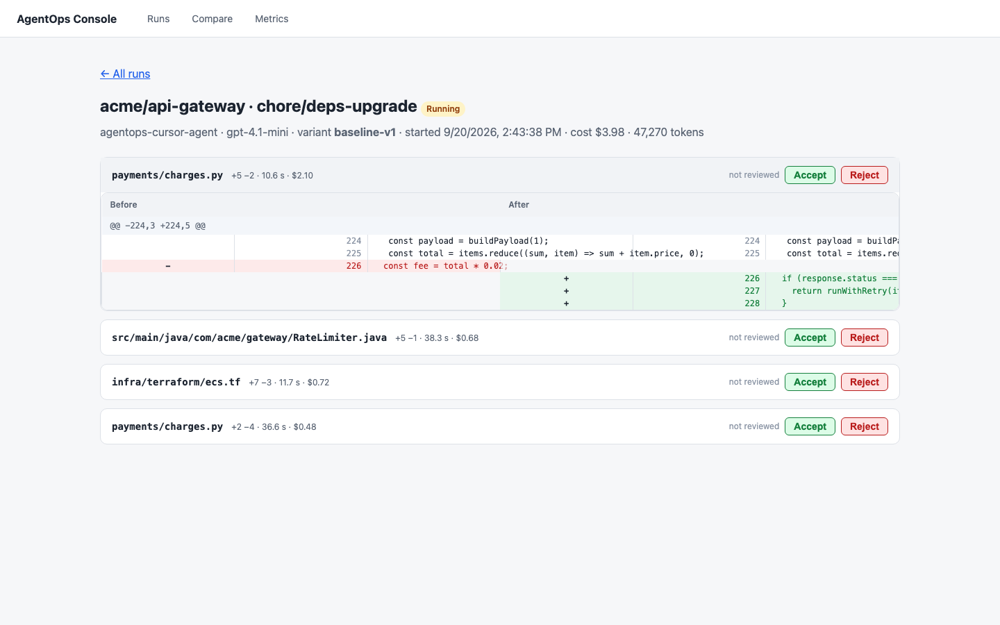
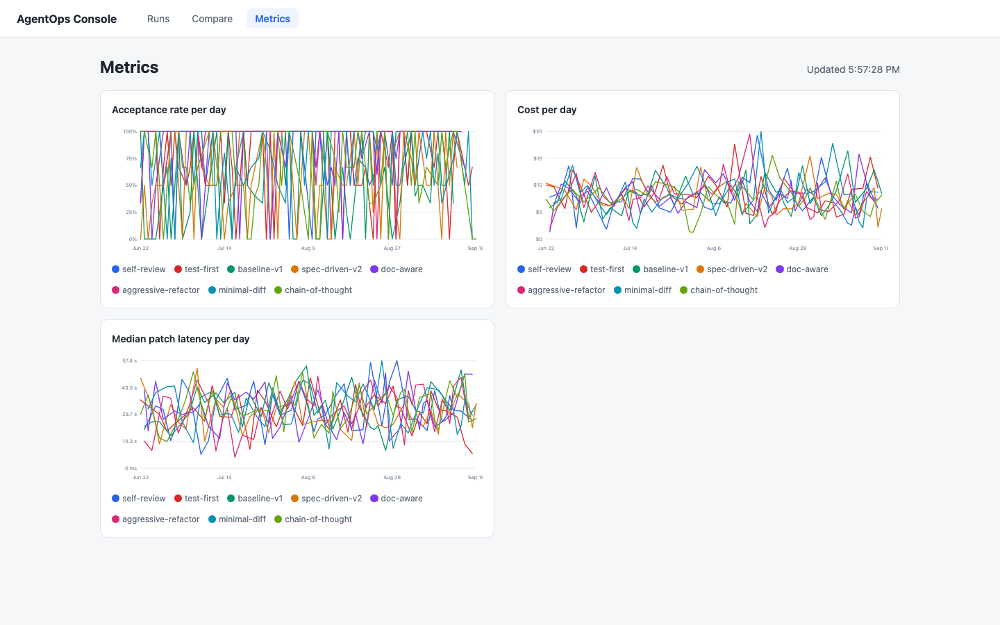

# AgentOps Console

**Problem.** Teams are shipping LLM-generated patches at machine speed, but
nobody can answer the questions that matter afterwards: which prompt variant
produced the code that survived review, why a patch was rejected, or what the
accepted patches actually cost. AgentOps Console is a self-hosted record of
every agent run — the prompt variant used, every patch with its full diff, the
human or bot verdict on it (with override reasons), and the cost and latency of
producing it — so engineering can make these decisions with data instead of
anecdotes.

## Architecture



One compose stack (`infra/docker-compose.yml`): Postgres (Flyway applies the
schema and seed on first boot), the Spring Boot API, the nginx-served React
SPA, and Prometheus scraping the backend plus — optionally — the existing
CopilotGuard and AgentDiff exporters.

## Quickstart

```bash
docker compose -f infra/docker-compose.yml up --build
```

| URL | What |
| --- | --- |
| http://localhost:5173 | Dashboard (seeded with 40 runs, 200 patches, 140 verdicts) |
| http://localhost:5173/runs/{id} | Run detail — expand a patch for the side-by-side diff, Accept/Reject it |
| http://localhost:5173/compare | Prompt-variant A/B comparison |
| http://localhost:5173/metrics | Live acceptance/cost/latency charts (15s polling) |
| http://localhost:8080/swagger-ui | Interactive OpenAPI docs for the REST API |
| http://localhost:8080/actuator/prometheus | Metrics endpoint scraped by Prometheus |
| http://localhost:9090 | Prometheus UI (includes the acceptance-rate alert rule) |

There is no login — it's a self-hosted demo tool; the seed data doubles as the
demo dataset. Want a busier dashboard for demos or screenshots? Load 500 more
runs:

```bash
./scripts/seed-demo.sh
```

> Verified from a clean `git clone` on macOS with Docker Desktop: `docker
> compose -f infra/docker-compose.yml up --build` brings up all four services,
> Flyway applies V1–V3, and the URLs above respond. (On macOS, Docker Desktop
> reserves host ports 5432–5434 and sometimes 8080/5173; the stack uses 5435
> for Postgres and `BACKEND_PORT`/`FRONTEND_PORT`/`PROMETHEUS_PORT` env vars
> override the rest.)

### Screenshots

| Runs list | Run detail | Live metrics |
| --------- | ---------- | ------------ |
|  |  |  |

## Schema

```mermaid
erDiagram
    PROMPT_VARIANT ||--o{ AGENT_RUN : "used by"
    AGENT_RUN ||--o{ PATCH : "produces"
    PATCH ||--o| REVIEW_VERDICT : "has at most one"
    PATCH ||--o{ REVIEW_AUDIT : "history of"

    PROMPT_VARIANT {
        uuid id PK
        text name UK
        text template
        text description
        timestamptz created_at
    }
    AGENT_RUN {
        uuid id PK
        uuid prompt_variant_id FK
        text tool
        text repo
        text branch
        text model
        timestamptz started_at
        timestamptz finished_at
        numeric total_cost_usd
        int total_tokens
        text status "RUNNING | SUCCEEDED | FAILED"
    }
    PATCH {
        uuid id PK
        uuid run_id FK
        text file_path
        text diff_unified
        int lines_added
        int lines_removed
        int latency_ms
        numeric cost_usd
        timestamptz created_at
    }
    REVIEW_VERDICT {
        uuid id PK
        uuid patch_id FK_UK
        text reviewer
        text decision "ACCEPTED | REJECTED"
        text override_reason
        timestamptz decided_at
    }
    REVIEW_AUDIT {
        uuid id PK
        uuid patch_id FK
        text reviewer
        text decision
        text override_reason
        text action "CREATED | AMENDED"
        timestamptz changed_at
    }
```

**Why this is (mostly) 3NF**

- **1NF** — every column is atomic; the unified diff is one `text` column per
  patch rather than a bag of sub-tables.
- **2NF** — single-column UUID keys mean no partial-key dependencies; every
  attribute describes the whole row it lives on.
- **3NF** — no transitive dependencies:
  - a run stores `prompt_variant_id`, not the variant's name/template
    (`variantName` in API responses is a JOIN, never a column);
  - verdict fields (`reviewer`, `decision`, `override_reason`) live on
    `review_verdict` keyed by `patch_id`, not denormalised onto `patch` or
    `agent_run`;
  - history is temporal: `review_audit` appends every change, and
    `review_verdict` keeps only the current state.
- The one deliberate denormalisation: `agent_run.total_cost_usd` /
  `total_tokens` are aggregates over a run's patches, recomputed on ingest, kept
  so the dashboard never aggregates 200 rows to render a list row.

## API reference

Errors are RFC 7807 `application/problem+json` (`type`, `title`, `status`,
`detail`, `instance`, plus `errors` for field validation). Full interactive docs:
`/swagger-ui`.

| Method | Path | Purpose | Sample |
| ------ | ---- | ------- | ------ |
| GET | `/api/runs?variantId=&status=&from=&to=&page=&size=` | Paginated runs, newest first | `→ {"items":[{"id":"…","patchCount":5,"acceptedPatches":2,…}],"page":0,"size":20,"totalElements":540,"totalPages":27}` |
| GET | `/api/runs/{id}` | Run + its patches + each patch's verdict | `→ {"run":{…},"patches":[{"filePath":"src/x.ts","diffUnified":"…","verdict":null}]}` |
| POST | `/api/runs` | Ingest a run with patches (atomic) | `{"tool":"agentops-codex","repo":"acme/webapp","variantId":"…","patches":[…]}` `→ 201` |
| GET | `/api/patches/{id}` | One patch with full diff | `→ {"id":"…","diffUnified":"diff --git …","verdict":{"decision":"ACCEPTED",…}}` |
| POST | `/api/patches/{id}/review` | First verdict; 409 if already reviewed | `{"reviewer":"alice","decision":"ACCEPTED"}` `→ 201` |
| PUT | `/api/patches/{id}/review` | Amend a verdict; history kept in `review_audit` | `{"reviewer":"diana","decision":"REJECTED","overrideReason":"flaky test"}` `→ 200` |
| GET | `/api/variants` | All prompt variants | `→ [{"id":"…","name":"baseline-v1","template":"…"}]` |
| POST | `/api/variants` | Create a variant (unique name) | `{"name":"cot-v2","template":"Think step by step…"}` `→ 201` |
| GET | `/api/metrics/acceptance?bucket=day\|week` | Acceptance rate per variant per bucket | `→ [{"variantId":"…","bucketStart":"2026-08-03T00:00:00Z","accepted":3,"total":4,"acceptanceRate":0.75}]` |
| GET | `/api/metrics/cost-latency?bucket=day\|week` | p50/p95 latency + summed cost per variant | `→ [{"variantId":"…","p50LatencyMs":2500.0,"p95LatencyMs":3850.0,"totalCostUsd":10.0,"patchCount":4}]` |
| GET | `/actuator/health`, `/actuator/prometheus` | Health probes; Prometheus metrics | `→ {"status":"UP"}` / counter exposition |

`POST /api/patches/{id}/review` rejects `REJECTED` verdicts without a
non-blank `overrideReason` (400).

## Performance

Real `EXPLAIN (ANALYZE, BUFFERS)` runs against the seeded + demo dataset
(540 runs, 2930 patches, 1981 verdicts; warm cache).

**The dashboard's main query — recent runs** (`ORDER BY started_at DESC LIMIT 20`):

Before `idx_agent_run_started_at` — full table scan + sort:

```text
Limit  (actual time=0.180..0.185 rows=20)
  ->  Sort (Sort Key: started_at DESC)  (actual time=0.177..0.178 rows=20)
        ->  Seq Scan on agent_run  (rows=540)  (actual time=0.007..0.073)
Execution Time: 0.251 ms
```

After — index scan reads only the 20 needed rows:

```text
Limit  (actual time=0.026..0.035 rows=20)
  ->  Index Scan using idx_agent_run_started_at on agent_run
      (actual time=0.026..0.033 rows=20)
Execution Time: 0.057 ms
```

**The acceptance-rate metrics query** (`date_trunc` + `GROUP BY` over the last
90 days): at this scale the planner correctly chooses hash joins either way
(≈1.8–6.5 ms, `Seq Scan on review_verdict` with `Rows Removed by Filter: 763`).
When scans are disabled to expose the index access paths, the plan uses exactly
the V1 indexes the SQL comments document:

```text
->  Bitmap Heap Scan on review_verdict rv
      Recheck Cond: (decided_at >= now() - '90 days'::interval)
      ->  Bitmap Index Scan on idx_review_verdict_decision_decided_at
->  Index Scan using idx_patch_run_id on patch p
```

The indexes win as data grows (the 90-day filter on `(decision, decided_at)`
becomes selective); the run-list index wins immediately, which is why
`agent_run(started_at DESC)` was in V1.

## Monitoring

`infra/prometheus/rules.yml` alerts when acceptance over the trailing hour
drops below 50% (`AgentOpsAcceptanceRateTooLow`). The custom
`agentops_patches_reviewed_total{decision=}` counter and
`agentops_run_ingest_seconds` timer feed that rule. CopilotGuard/AgentDiff
exporter targets are optional and configured via env vars
(`COPILOTGUARD_HOST/PORT`, `AGENTDIFF_HOST/PORT`); the stack starts without them.

## Development & CI

See [CONTRIBUTING.md](CONTRIBUTING.md) for the local dev loop. CI
(`.github/workflows/ci.yml`) runs on every push and PR: `mvn verify` (unit +
slice + Testcontainers tests, JaCoCo ≥80% line coverage on service/controller
packages), `npm ci && tsc --noEmit && npm run lint && npm test` (Vitest + MSW),
and a Playwright suite that boots the compose stack, rejects a patch, and
asserts the acceptance rate drops.

## Built with AI assistance

The entire repository — schema and migrations, backend, frontend, tests, and
CI — was generated with AI coding agents (OpenCode) over several sessions.

**Agent-generated:** all of it; the prompts specified the stack, the schema,
the endpoints, the acceptance rules, and the coverage gates.

**Changed after review:** the Postgres host port moved to 5435 (Docker Desktop
reserves 5432–5434); the DB session timezone was pinned to UTC so `date_trunc`
buckets are deterministic; review semantics were tightened to
400-reject-without-reason / 409-already-reviewed / PUT-amends.

**Two bugs caught in generated code:**

1. **Metrics page crashed with `RangeError: Invalid time value`** — the cost
   chart rendered before its query resolved; `Math.min()` over an empty point
   list returned `Infinity`, the tick math produced `NaN`, and
   `new Date(NaN).toISOString()` threw, unmounting the app. The Playwright E2E
   run caught it; fixed with an empty-series guard plus a regression test.
2. **Proxied POSTs returned 403 "Invalid CORS request"** — nginx forwarded the
   browser's `Origin` header to the backend, whose CORS allowlist only
   contained `localhost:5173`, so any non-default frontend port broke Accept /
   Reject. Caught by E2E; fixed by stripping `Origin` at the proxy.
   (Earlier: Flyway treated `${API_BASE}` inside seeded diffs as a placeholder,
   and Hibernate's expansion of duplicate `:bucket` params broke PostgreSQL's
   GROUP BY expression matching — both fixed with regression coverage.)
